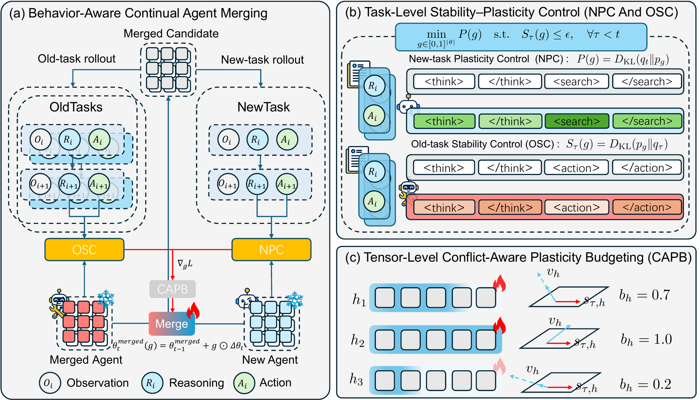
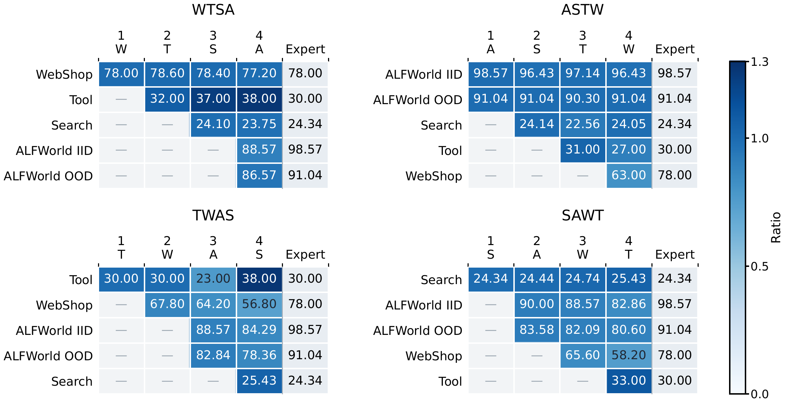

# BACAM

Official implementation of **BACAM: Behavior-Aware Continual Agent Merging for Multi-Turn Interaction**.

Model merging offers a way to integrate the capabilities of specialized experts,
but existing agent merging methods typically require all of them to be available
at once. We study continual agent merging, which integrates incoming experts
sequentially without retaining previously merged experts. Yet merging in parameter
space or feature subspaces does not ensure that the merged model acquires an
incoming expert's behavior on interaction trajectories. Moreover, updates toward
a new expert can disrupt the merged model's previously integrated interactive
behavior. Therefore, we propose Behavior-Aware Continual Agent Merging (BACAM),
which learns parameter-wise merging gates from candidate-generated trajectories
using expert-guided behavioral supervision. Task-level stability–plasticity control
and tensor-level conflict-aware update budgets limit interference with existing
capabilities while allowing new ones to be acquired. The learned gates are folded
into the model weights without additional inference-time parameters. Across four
interactive tasks—web shopping, tool use, information retrieval, and embodied
interaction—BACAM achieves an average success rate of 62.82%, exceeding the
strongest evaluated merging baseline by 21.69 percentage points.

## Contents

- [Method](#method)
- [Results](#results)
- [Installation](#installation)
- [Expert models](#expert-models)
- [External repositories](#external-repositories)
- [Data preparation](#data-preparation)
- [Training and evaluation](#training-and-evaluation)
- [Code layout](#code-layout)
- [Acknowledgements](#acknowledgements)
- [License](#license)

## Method



BACAM learns parameter-wise gates between the current merged model and each
incoming expert. It comprises two components:

1. **Task-Level Stability–Plasticity Control.** On candidate-generated histories,
   New-task Plasticity Control (NPC) uses forward KL to acquire the incoming
   expert's behavior, while Old-task Stability Control (OSC) constrains reverse KL
   to the current merged model to preserve existing behavior.
2. **Tensor-Level Conflict-Aware Plasticity Budgeting (CAPB).** Local gradient
   probes identify conflicts and restrict gate updates toward the incoming expert
   in conflicting tensors.

The current merged model and incoming expert remain frozen, and only the
parameter-wise gate is optimized:

```text
theta_merged = theta_old + g * (theta_new - theta_old),  g in [0, 1]
```

Earlier experts are no longer retained, but the instances and environments for all
integrated tasks remain available for collecting trajectories. All experts share
the same architecture and tokenizer.

## Results

Final success rates (SR, %) after four experts. Continual methods use WTSA; batch
methods use the same experts. Avg is the mean of the five reported columns,
counting the two ALFWorld splits separately.

| Method | WebShop | Tool | Search | ALFWorld IID | ALFWorld OOD | Avg |
| --- | ---: | ---: | ---: | ---: | ---: | ---: |
| Weight Average | 4.80 | 0.00 | 21.76 | 35.00 | 37.31 | 19.78 |
| Task Arithmetic | 32.00 | 2.00 | 20.82 | 66.43 | 58.21 | 35.89 |
| TIES-Merging | 38.40 | 0.00 | 15.17 | 53.57 | 56.72 | 32.77 |
| TSV-Merge | 39.40 | 1.00 | 23.10 | 68.57 | 66.42 | 39.70 |
| WUDI-Merging | 38.20 | 0.00 | 25.14 | 72.14 | 70.15 | 41.13 |
| AdaMerging | 16.80 | 1.00 | 15.27 | 62.86 | 59.70 | 31.13 |
| RAM++ | 37.20 | 1.00 | 20.33 | 61.43 | 50.00 | 33.99 |
| OPCM | 22.60 | 1.00 | 21.52 | 46.43 | 41.79 | 26.67 |
| NUFILT | 10.00 | 1.00 | 20.53 | 36.43 | 32.84 | 20.16 |
| **BACAM** | **77.20** | **38.00** | **23.75** | **88.57** | **86.57** | **62.82** |

This is a selection of the evaluated baselines; the [full comparison and ablations](docs/RESULTS.md)
include all methods. Tool uses BFCL v3 `multi_turn_base`; Search uses MuSiQue.

### Performance across merging stages



W, T, S, and A denote WebShop, Tool, Search, and ALFWorld. Cell values are SR;
shading shows SR relative to the corresponding expert. A dash marks tasks not yet
integrated. Final Avg SR ranges from 56.02% in SAWT to 62.82% in WTSA.

## Installation

Install the core environment:

```bash
git clone https://github.com/shuaitongli/BACAM.git
cd BACAM

conda create -n bacam python=3.12 -y
conda activate bacam
python -m pip install -r requirements.txt
python -m pip install packaging ninja psutil setuptools
python -m pip install flash-attn --no-build-isolation
```

Default resource directories are `models/`, `datasets/`, and `third_party/`.
Set GPU IDs and ports in `configs/experiment.json`; configure resource paths and
agent-specific interpreters using [PATHS.md](docs/PATHS.md).

## Expert models

Download the four specialized experts built on Qwen2.5-7B-Instruct into `models/`:

| Agent | Hugging Face checkpoint |
| --- | --- |
| WebShop | [langfeng01/GiGPO-Qwen2.5-7B-Instruct-WebShop](https://huggingface.co/langfeng01/GiGPO-Qwen2.5-7B-Instruct-WebShop) |
| Tool | [emrecanacikgoz/Qwen2.5-7B-Instruct-ToolRL-grpo-cold](https://huggingface.co/emrecanacikgoz/Qwen2.5-7B-Instruct-ToolRL-grpo-cold) |
| Search | [agentrl/ReSearch-Qwen-7B-Instruct](https://huggingface.co/agentrl/ReSearch-Qwen-7B-Instruct) |
| ALFWorld | [langfeng01/GiGPO-Qwen2.5-7B-Instruct-ALFWorld](https://huggingface.co/langfeng01/GiGPO-Qwen2.5-7B-Instruct-ALFWorld) |

```bash
hf download langfeng01/GiGPO-Qwen2.5-7B-Instruct-WebShop \
  --local-dir models/GiGPO-Qwen2.5-7B-Instruct-WebShop
hf download emrecanacikgoz/Qwen2.5-7B-Instruct-ToolRL-grpo-cold \
  --local-dir models/Qwen2.5-7B-Instruct-ToolRL-grpo-cold
hf download agentrl/ReSearch-Qwen-7B-Instruct \
  --local-dir models/ReSearch-Qwen-7B-Instruct
hf download langfeng01/GiGPO-Qwen2.5-7B-Instruct-ALFWorld \
  --local-dir models/GiGPO-Qwen2.5-7B-Instruct-ALFWorld
```

## External repositories

| Agent | Repository |
| --- | --- |
| Search | [ReSearch (ReCall, re-search branch)](https://github.com/Agent-RL/ReCall/tree/re-search) |
| Tool | [ToolRL](https://github.com/qiancheng0/ToolRL), [BFCL](https://github.com/ShishirPatil/gorilla/tree/main/berkeley-function-call-leaderboard) |
| ALFWorld | [verl-agent / GiGPO](https://github.com/langfengQ/verl-agent), [ALFWorld](https://github.com/alfworld/alfworld) |
| WebShop | [verl-agent / GiGPO](https://github.com/langfengQ/verl-agent), [WebShop](https://github.com/princeton-nlp/WebShop) |

Use a separate environment for each agent, installed following its original repository.
Do not install all agent dependencies into the core training environment.

| Component | Interpreter / command setting |
| --- | --- |
| Core training and teacher caching | `BACAM_PYTHON`, `BACAM_TORCHRUN` |
| Tool | `BACAM_TOOL_PYTHON`, `BACAM_BFCL` |
| Search evaluation and retrieval | `BACAM_SEARCH_PYTHON` |
| Search model serving | `BACAM_SGLANG_PYTHON` |
| ALFWorld environment | `BACAM_ALFWORLD_PYTHON` |
| WebShop environment | `BACAM_WEBSHOP_PYTHON` |
| ALFWorld / WebShop model serving | `BACAM_VLLM` |

Create `configs/paths.env` from `configs/paths.env.example` and set the executable
paths for your environments; see [PATHS.md](docs/PATHS.md).
Load this file in the same shell before running BACAM commands:

```bash
source configs/paths.env
```

Place the checkouts at `third_party/ReSearch`,
`third_party/bfcl-toolrl`, and `third_party/verl-agent`, or override their locations
as described in [PATHS.md](docs/PATHS.md).
For BFCL, use the [2025.7.17 source distribution](https://pypi.org/project/bfcl-eval/2025.7.17/#files),
download the archive into the BACAM root, then run in the Tool environment:

```bash
mkdir -p third_party/bfcl-toolrl
tar -xzf bfcl_eval-2025.7.17.tar.gz --strip-components=1 -C third_party/bfcl-toolrl
python -m pip install -e './third_party/bfcl-toolrl[oss_eval_vllm]'
```

BACAM's Search and Tool interfaces are included under `integrations/`.
After installing the external repositories, install these interfaces from the
BACAM root in the core environment:

```bash
bash scripts/install_adapters.sh
```

## Data preparation

Prepare the following datasets, then generate the four split files under `data/splits/`:

| Agent | Dataset used | Download/source |
| --- | --- | --- |
| Search | MuSiQue development questions in FlashRAG format | [FlashRAG datasets](https://huggingface.co/datasets/RUC-NLPIR/FlashRAG_datasets); ReSearch also provides `data/download_dataset.sh` |
| Tool | BFCL `multi_turn_base` cases, tool definitions, and reference answers | Included under `bfcl_eval/data/` in the BFCL source distribution specified above |
| ALFWorld | TextWorld household game files: training games, `valid_seen`, and `valid_unseen` | [ALFWorld download instructions](https://github.com/alfworld/alfworld#quickstart), using `alfworld-download` |
| WebShop | The 1,000-product subset and its shopping instructions | [WebShop setup instructions](https://github.com/princeton-nlp/WebShop#-setup), using the small dataset option |

Search additionally needs the Wikipedia corpus and retrieval index described in
[ReSearch's README](https://github.com/Agent-RL/ReCall/tree/re-search).
The default Search question file is `datasets/flashrag_eval/musique/dev.jsonl`.
WebShop expects `items_shuffle_1000.json`, `items_ins_v2_1000.json`, and
`items_human_ins.json` under `datasets/webshop/`; build its index with
`python -m bacam.data.build_webshop_index` from the repository root in the WebShop
environment.

Generate the split inputs locally. Run each command in the corresponding agent
environment, from the BACAM root:

```bash
python -m bacam.data.generate_splits --domain search
python -m bacam.data.generate_splits --domain tool
python -m bacam.data.generate_splits --domain alfworld
python -m bacam.data.generate_splits --domain webshop
```

Split files are generated locally under `data/splits/`. The paper's selected IDs
are not distributed; results may vary with locally generated splits.
See [DATA_FORMAT.md](docs/DATA_FORMAT.md) for the input format.

## Training and evaluation

Once models, environments, data, and indexes are prepared, run from the repository root:

```bash
conda activate bacam
bash scripts/services/start_retriever.sh
bash scripts/run_all.sh
```

To continue an interrupted run:

```bash
bash scripts/run_all.sh --resume
```

The default merging order is WebShop, Tool, Search, ALFWorld, with the WebShop
expert as the initial model. Merged weights are saved under `outputs/models/`,
evaluation results under `artifacts/eval/`, and logs under `logs/`.

## Code layout

```text
BACAM/
├── bacam/                   Python package
│   ├── merging/             Gate updates, behavioral losses, training
│   ├── data/                States, teacher caches, dataset/index preparation
│   ├── rollout/             Agent interactions and trajectory conversion
│   ├── evaluation/          Held-out evaluation and result collection
│   ├── analysis/            Capability plots and tensor diagnostics
│   └── paths.py             Shared resource configuration
├── scripts/
│   ├── run_all.sh           Complete merging workflow
│   ├── install_adapters.sh  External repository adaptations
│   ├── cache_teacher.sh     Parallel teacher caching
│   ├── pipelines/           Per-stage merge pipelines
│   ├── rollout/             Agent rollout launchers
│   ├── evaluate/            Evaluation launchers
│   ├── services/            Retrieval and model serving
│   └── lib/                 Shared Shell helpers
├── configs/
│   ├── experiment.json      Merging, GPU and port settings
│   ├── expert_references.json  Expert reference scores
│   └── paths.env.example    Local resource settings template
├── docs/                    Configuration, data formats, paper results
├── integrations/            Required Search and Tool adaptations
├── assets/figures/          Paper figures (PNG and PDF)
├── pyproject.toml           Python package metadata
└── requirements.txt         Core dependencies
```

## Acknowledgements

BACAM uses experts and interaction environments from
[ReSearch](https://github.com/Agent-RL/ReCall/tree/re-search),
[ToolRL](https://github.com/qiancheng0/ToolRL),
[GiGPO / verl-agent](https://github.com/langfengQ/verl-agent),
[BFCL](https://github.com/ShishirPatil/gorilla/tree/main/berkeley-function-call-leaderboard),
[ALFWorld](https://github.com/alfworld/alfworld), and
[WebShop](https://github.com/princeton-nlp/WebShop).

We also thank [mergekit](https://github.com/arcee-ai/mergekit) for providing
model-merging baseline implementations used in our experiments.

## License

BACAM's original code is released under the [MIT License](LICENSE).
External repositories, model weights, and datasets remain subject to their own
licenses and usage conditions.
The adaptations under `integrations/` retain their upstream MIT or Apache-2.0
licenses, included alongside the files.
