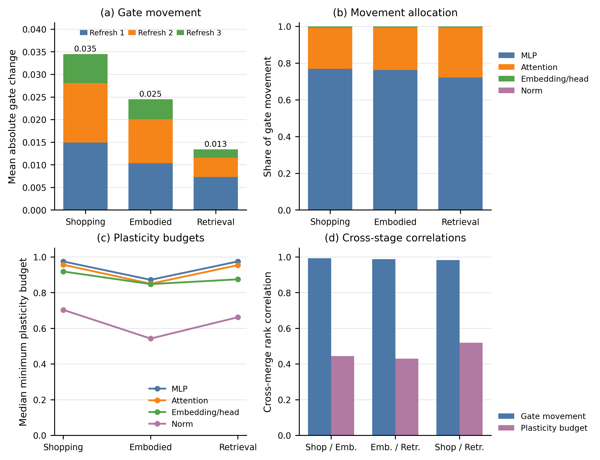

# Experimental results

Results reported in **BACAM: Behavior-Aware Continual Agent Merging for Multi-Turn
Interaction**. All success rates (SR) are on a 0–100 scale; higher is better.
Avg SR averages WebShop, Tool, Search, ALFWorld IID, and ALFWorld OOD, counting
the two ALFWorld splits separately. These tables report measured results, not
guaranteed outcomes for different datasets or environment configurations.

The experts share the Qwen2.5-7B-Instruct architecture. The default continual order
is WTSA: WebShop, Tool, Search, ALFWorld. Evaluations use WebShop, BFCL
`multi_turn_base`, MuSiQue, and ALFWorld `valid_seen` / `valid_unseen`.

## Final-model comparison

Continual methods follow WTSA; batch methods merge the same four experts. Each
individual expert is evaluated on all tasks, rather than only its own domain.

| Method | WebShop | Tool | Search | ALFWorld IID | ALFWorld OOD | Avg SR |
| --- | ---: | ---: | ---: | ---: | ---: | ---: |
| **Base model and individual experts** | | | | | | |
| Qwen2.5-7B-Instruct | 0.00 | 7.00 | 12.49 | 20.71 | 15.67 | 11.18 |
| WebShop expert | 78.00 | 4.00 | 7.34 | 24.29 | 20.90 | 26.90 |
| Tool expert | 0.00 | 30.00 | 12.74 | 10.71 | 13.43 | 13.38 |
| Search expert | 0.80 | 11.00 | 24.34 | 9.29 | 10.45 | 11.18 |
| ALFWorld expert | 1.80 | 16.00 | 14.92 | 98.57 | 91.04 | 44.47 |
| **General model merging** | | | | | | |
| Weight Average | 4.80 | 0.00 | 21.76 | 35.00 | 37.31 | 19.78 |
| Task Arithmetic | 32.00 | 2.00 | 20.82 | 66.43 | 58.21 | 35.89 |
| TIES-Merging | 38.40 | 0.00 | 15.17 | 53.57 | 56.72 | 32.77 |
| TA w/ DARE | 34.00 | 0.00 | 20.38 | 69.29 | 55.22 | 35.78 |
| TIES w/ DARE | 36.20 | 1.00 | 16.96 | 59.29 | 55.97 | 33.88 |
| TSV-Merge | 39.40 | 1.00 | 23.10 | 68.57 | 66.42 | 39.70 |
| Iso-C | 24.60 | 1.00 | 23.85 | 59.29 | 55.97 | 32.94 |
| WUDI-Merging | 38.20 | 0.00 | 25.14 | 72.14 | 70.15 | 41.13 |
| AdaMerging | 16.80 | 1.00 | 15.27 | 62.86 | 59.70 | 31.13 |
| AdaMerging++ | 21.40 | 1.00 | 18.69 | 62.86 | 60.45 | 32.88 |
| Expert Merging | 5.60 | 1.00 | 18.84 | 28.57 | 32.09 | 17.22 |
| **Agent model merging** | | | | | | |
| RAM | 34.60 | 1.00 | 21.02 | 56.43 | 52.99 | 33.21 |
| RAM++ | 37.20 | 1.00 | 20.33 | 61.43 | 50.00 | 33.99 |
| **Continual model merging** | | | | | | |
| OPCM | 22.60 | 1.00 | 21.52 | 46.43 | 41.79 | 26.67 |
| NUFILT | 10.00 | 1.00 | 20.53 | 36.43 | 32.84 | 20.16 |
| **BACAM** | **77.20** | **38.00** | **23.75** | **88.57** | **86.57** | **62.82** |

BACAM exceeds the strongest evaluated merging baseline, WUDI-Merging, by 21.69
percentage points in Avg SR. It does not lead on every task: WUDI-Merging achieves
higher Search SR, and BACAM does not fully recover the ALFWorld expert's performance.

## Component ablations

Four-expert results under WTSA. The variants change the KL directions, response
token weighting, or tensor conflict budget while retaining behavioral supervision.

| Variant | WebShop | Tool | Search | ALFWorld IID | ALFWorld OOD | Avg SR |
| --- | ---: | ---: | ---: | ---: | ---: | ---: |
| WUDI-Merging (reference) | 38.20 | 0.00 | 25.14 | 72.14 | 70.15 | 41.13 |
| OPCM (reference) | 22.60 | 1.00 | 21.52 | 46.43 | 41.79 | 26.67 |
| Forward KL for all tasks | 76.80 | 30.00 | 23.30 | 89.29 | 85.07 | 60.89 |
| Reverse KL for all tasks | 77.00 | 36.00 | 24.05 | 87.86 | 85.82 | 62.14 |
| Uniform token weighting | 77.00 | 35.00 | 23.55 | 87.14 | 84.33 | 61.40 |
| Without conflict budget | 77.40 | 34.00 | 22.81 | 87.86 | 85.82 | 61.58 |
| **BACAM** | **77.20** | **38.00** | **23.75** | **88.57** | **86.57** | **62.82** |

## Two- and three-expert merging

Continual methods follow WebShop, Tool, Search; batch methods merge the same
expert subset. Each Avg averages only the tasks in its expert group.

| Method | 2 experts: WebShop | Tool | Avg | 3 experts: WebShop | Tool | Search | Avg |
| --- | ---: | ---: | ---: | ---: | ---: | ---: | ---: |
| Weight Average | 26.60 | 1.00 | 13.80 | 7.00 | 0.00 | 22.21 | 9.74 |
| Task Arithmetic | 26.60 | 1.00 | 13.80 | 24.60 | 1.00 | 21.86 | 15.82 |
| TIES-Merging | 31.20 | 0.00 | 15.60 | 30.60 | 0.00 | 16.31 | 15.64 |
| TSV-Merge | 35.40 | 1.00 | 18.20 | 36.80 | 0.00 | 23.75 | 20.18 |
| WUDI-Merging | 34.40 | 0.00 | 17.20 | 33.60 | 0.00 | 24.84 | 19.48 |
| RAM | 34.60 | 0.00 | 17.30 | 33.00 | 0.00 | 21.27 | 18.09 |
| RAM++ | 33.80 | 0.00 | 16.90 | 32.20 | 2.00 | 21.17 | 18.46 |
| OPCM | 33.20 | 1.00 | 17.10 | 22.00 | 1.00 | 20.62 | 14.54 |
| NUFILT | 9.80 | 0.00 | 4.90 | 8.20 | 0.00 | 20.53 | 9.58 |
| **BACAM** | **78.60** | **32.00** | **55.30** | **78.40** | **37.00** | **24.10** | **46.50** |

## Task scores and interaction lengths

WebShop task score (TS) is on a 0–100 scale; higher is better. Round averages
interaction steps over all episodes, including failures; lower is better, but
should be interpreted together with task performance. The TSWA NUFILT result is
a separate reference order, not the default WTSA run.

| Method | ALFWorld IID Round | ALFWorld OOD Round | WebShop TS | WebShop Round |
| --- | ---: | ---: | ---: | ---: |
| Qwen2.5-7B-Instruct | 44.34 | 46.19 | 1.79 | 14.78 |
| Search expert | 48.00 | 47.10 | 4.45 | 14.49 |
| Tool expert | 47.32 | 47.19 | 1.96 | 14.85 |
| ALFWorld expert | 8.43 | 12.52 | 25.16 | 11.46 |
| WebShop expert | 42.02 | 42.78 | 88.41 | 6.11 |
| Weight Average | 37.61 | 37.45 | 26.87 | 12.05 |
| Task Arithmetic | 24.19 | 28.20 | 56.66 | 9.79 |
| TIES-Merging | 28.64 | 29.00 | 62.00 | 9.52 |
| TA w/ DARE | 24.05 | 30.68 | 56.41 | 9.82 |
| TIES w/ DARE | 27.11 | 28.84 | 59.76 | 9.54 |
| TSV-Merge | 22.90 | 24.67 | 65.18 | 9.01 |
| Iso-C | 27.17 | 29.38 | 52.86 | 9.94 |
| WUDI-Merging | 21.46 | 24.31 | 54.24 | 10.01 |
| AdaMerging | 26.71 | 28.36 | 49.50 | 9.74 |
| AdaMerging++ | 26.20 | 26.20 | 53.15 | 9.98 |
| Expert Merging | 38.73 | 39.84 | 29.00 | 11.89 |
| RAM | 29.09 | 30.15 | 61.54 | 9.06 |
| RAM++ | 27.48 | 31.49 | 61.09 | 9.31 |
| OPCM | 32.69 | 35.47 | 44.76 | 10.76 |
| NUFILT | 37.49 | 39.31 | 32.73 | 11.79 |
| NUFILT (TSWA reference) | 37.50 | 36.94 | 28.83 | 11.95 |
| **BACAM** | **14.01** | **14.69** | **88.16** | **6.09** |

## Performance across merging stages

W = WebShop, T = Tool, S = Search, A = ALFWorld. Stage 1 is the initial expert;
later stages integrate one additional expert. A dash indicates that the
corresponding expert has not yet been integrated, not a score of zero.
WebShop TS is the benchmark's task score, also reported on a 0–100 scale.

[Vector figure (PDF)](../assets/figures/merging_stages.pdf)

| Order | Stage | WebShop SR | Tool SR | Search SR | ALFWorld IID SR | ALFWorld OOD SR | WebShop TS |
| --- | --- | ---: | ---: | ---: | ---: | ---: | ---: |
| WTSA | 1: W | 78.00 | — | — | — | — | 88.41 |
| WTSA | 2: + T | 78.60 | 32.00 | — | — | — | 88.58 |
| WTSA | 3: + S | 78.40 | 37.00 | 24.10 | — | — | 88.32 |
| WTSA | 4: + A | 77.20 | 38.00 | 23.75 | 88.57 | 86.57 | 88.16 |
| ASTW | 1: A | — | — | — | 98.57 | 91.04 | — |
| ASTW | 2: + S | — | — | 24.14 | 96.43 | 91.04 | — |
| ASTW | 3: + T | — | 31.00 | 22.56 | 97.14 | 90.30 | — |
| ASTW | 4: + W | 63.00 | 27.00 | 24.05 | 96.43 | 91.04 | 77.51 |
| TWAS | 1: T | — | 30.00 | — | — | — | — |
| TWAS | 2: + W | 67.80 | 30.00 | — | — | — | 80.95 |
| TWAS | 3: + A | 64.20 | 23.00 | — | 88.57 | 82.84 | 79.09 |
| TWAS | 4: + S | 56.80 | 38.00 | 25.43 | 84.29 | 78.36 | 71.39 |
| SAWT | 1: S | — | — | 24.34 | — | — | — |
| SAWT | 2: + A | — | — | 24.44 | 90.00 | 83.58 | — |
| SAWT | 3: + W | 65.60 | — | 24.74 | 88.57 | 82.09 | 79.09 |
| SAWT | 4: + T | 58.20 | 33.00 | 25.43 | 82.86 | 80.60 | 73.69 |

## Tensor-level diagnostics

The interpolation gate remains parameter-wise; a shared budget for each tensor
restricts positive gate updates toward the incoming expert. The figures below
analyze gate movement and conflict budgets across integrations. They describe
parameter adaptation, not causal estimates of tensor importance.

### TWAS

Under TWAS, gate movement decreases across integrations (0.035, 0.025, 0.013).
MLP tensors account for 72–77% of total movement, and LayerNorm receives the
tightest plasticity budgets.

| Diagnostic | Preview | Vector figure |
| --- | --- | --- |
| Gate/budget overview | [PNG](../assets/figures/diagnostics_TWAS_overview.png) | [PDF](../assets/figures/diagnostics_TWAS_overview.pdf) |
| Layer-wise map | [PNG](../assets/figures/diagnostics_TWAS_layer_map.png) | [PDF](../assets/figures/diagnostics_TWAS_layer_map.pdf) |
| Budget–movement scatter | [PNG](../assets/figures/diagnostics_TWAS_scatter.png) | [PDF](../assets/figures/diagnostics_TWAS_scatter.pdf) |
| Value-projection conflicts | [PNG](../assets/figures/diagnostics_TWAS_value_conflict.png) | [PDF](../assets/figures/diagnostics_TWAS_value_conflict.pdf) |

### SAWT

| Diagnostic | Preview | Vector figure |
| --- | --- | --- |
| Gate/budget overview | [PNG](../assets/figures/diagnostics_SAWT_overview.png) | [PDF](../assets/figures/diagnostics_SAWT_overview.pdf) |
| Layer-wise map | [PNG](../assets/figures/diagnostics_SAWT_layer_map.png) | [PDF](../assets/figures/diagnostics_SAWT_layer_map.pdf) |
| Budget–movement scatter | [PNG](../assets/figures/diagnostics_SAWT_scatter.png) | [PDF](../assets/figures/diagnostics_SAWT_scatter.pdf) |
| Value-projection conflicts | [PNG](../assets/figures/diagnostics_SAWT_value_conflict.png) | [PDF](../assets/figures/diagnostics_SAWT_value_conflict.pdf) |

## Method figures

| Figure | Preview | Vector figure |
| --- | --- | --- |
| Batch versus continual agent merging | [PNG](../assets/figures/continual_merging.png) | [PDF](../assets/figures/continual_merging.pdf) |
| BACAM framework | [PNG](../assets/figures/overview.png) | [PDF](../assets/figures/overview.pdf) |
